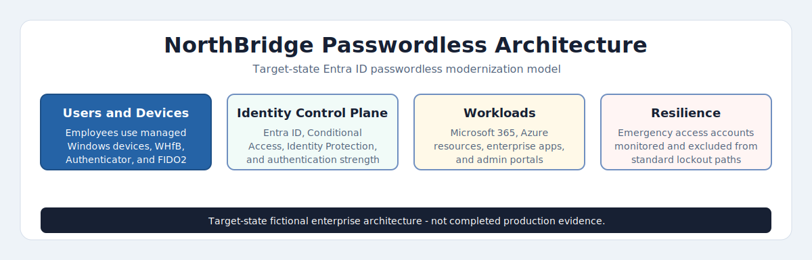
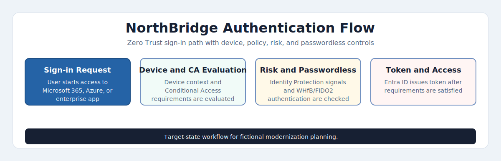

# NorthBridge Financial Group — Passwordless Authentication Modernization

**Microsoft Entra ID | Windows Hello for Business | FIDO2 | Authenticator | TAP | Conditional Access**

---

> *"Passwords are the most exploited credential vector in financial services.  
> This project documents a phased path to reduce password dependency without breaking operations."*

---

## Project Overview

NorthBridge Financial Group is a fictional federally regulated Canadian financial institution operating under OSFI-style requirements, with **40,000+ employees**, **1,100+ branches**, and a hybrid workforce spanning corporate offices, branch counters, and remote knowledge workers.

Following a simulated password-spray incident that compromised 14 branch accounts in Q3 2024, the Identity & Access Management team initiated a phased passwordless authentication modernization program under the direction of the Chief Information Security Officer.

This repository is an **in-progress production-style architecture and rollout planning case study**. It documents the business problem, current-state assessment, target-state architecture, Conditional Access design, support model, and early automation drafts for moving a large workforce from password-based authentication toward phishing-resistant sign-in across Windows workstations, mobile users, and shared branch terminals.

This is not presented as a completed tenant deployment. Implementation evidence, pilot results, screenshots, and final rollout artifacts are planned future additions.

---

## Current Evidence Status

| Area | Current State |
|---|---|
| Business case and scenario | Documented |
| Current-state identity assessment | Scenario-based baseline documented |
| Target passwordless architecture | Documented |
| Conditional Access authentication strength design | Drafted |
| Help desk support procedure | Drafted |
| PowerShell automation | Two draft scripts included |
| Tenant screenshots | Not included yet |
| Pilot or production deployment evidence | Not included yet |
| Physical device/FIDO2 rollout evidence | Not included yet |

---

## Why Passwordless — The Business Case

| Driver | Detail |
|---|---|
| **Regulatory pressure** | OSFI B-13 Technology and Cyber Risk Guideline requires phishing-resistant MFA for privileged and high-risk access |
| **Incident response** | Q3 2024 password-spray attack — 14 accounts compromised, 6-hour containment, $340K estimated response cost |
| **Zero Trust alignment** | NorthBridge Zero Trust roadmap requires device-bound, phishing-resistant credentials by Q4 2025 |
| **User experience** | 2,200 help desk tickets per quarter are password-related (resets, lockouts, expired credentials) |
| **Operational cost** | Password reset tickets cost an estimated $18-$22 per ticket — $40K-$48K per quarter in support overhead |

---

## Connection to AD Identity Operations Toolkit

This project is the direct continuation of the **[AD-Identity-Operations-Toolkit](https://github.com/rahatislamanik-spec/AD-Identity-Operations-Toolkit)**.

Phase 0 of this program consumed the user account audit output from that toolkit to:
- Identify stale and orphaned accounts ineligible for passwordless enrollment
- Baseline authentication method registration across the tenant
- Flag shared accounts and service accounts requiring exception handling
- Confirm hybrid identity sync health before Entra ID method rollout

The AD toolkit established the identity foundation. This project builds the authentication layer on top of it.

---

## Authentication Method Coverage

| Method | Use Case | Device Type | Phishing-Resistant | Phase |
|---|---|---|---|---|
| **Windows Hello for Business** | Primary sign-in for corporate Windows devices | Managed Windows 10/11 | Yes | Phase 1-2 |
| **FIDO2 Security Keys** | Shared workstations, branch terminals, privileged access | Any | Yes | Phase 2-3 |
| **Microsoft Authenticator Passwordless** | Remote and mobile workers | iOS / Android | Yes | Phase 1-2 |
| **Temporary Access Pass (TAP)** | Onboarding, device replacement, recovery | Any | Time-limited | Ongoing |
| **Certificate-based Auth (CBA)** | Executive and high-privilege accounts | Managed devices | Yes | Phase 2 |

---

## Repository Structure

    NorthBridge-Passwordless-Modernization/
    |
    +-- 00-project-overview/
    |   +-- business-problem.md
    |   +-- current-state-assessment.md
    |   +-- target-state-architecture.md
    |   +-- northbridge-passwordless-architecture.html
    |   +-- northbridge-authentication-flow.html
    |
    +-- 02-conditional-access/
    |   +-- authentication-strength-policy.md
    |
    +-- 05-support-model/
    |   +-- help-desk-procedures.md
    |
    +-- scripts/
        +-- Get-PasswordlessReadiness.ps1
        +-- New-TAPForUser.ps1

Planned future sections include authentication method deep dives, pilot cohort design, rollout phase documentation, exception handling, and sanitized evidence artifacts.

---

## Architecture & Authentication Flow

The following HTML artifacts support the target-state architecture. They are planning and portfolio documentation artifacts, not evidence of a completed production deployment.

Visualizes the target Microsoft Entra ID passwordless architecture across users and devices, identity control plane, and workloads.

[View interactive HTML version](https://rahatislamanik-spec.github.io/NorthBridge-Passwordless-Modernization/00-project-overview/northbridge-passwordless-architecture.html)

Shows the target Zero Trust sign-in workflow using device context, Conditional Access, Identity Protection, passwordless authentication, and Entra ID token issuance.

[View interactive HTML version](https://rahatislamanik-spec.github.io/NorthBridge-Passwordless-Modernization/00-project-overview/northbridge-authentication-flow.html)

These diagrams use planned success metrics and target-state workflow design rather than completed production results.

---

## Rollout Summary

| Phase | Cohort | Size | Timeline | Gate |
|---|---|---|---|---|
| **Phase 1** | IT staff + identity champions | ~150 users | Weeks 1-4 | 95% WHfB registration, zero critical incidents |
| **Phase 2** | Corporate knowledge workers | ~12,000 users | Weeks 5-12 | <2% help desk escalation rate |
| **Phase 3** | Branch staff + shared devices | ~25,000 users | Weeks 13-24 | FIDO2 key deployed to all shared terminals |
| **Phase 4** | Legacy exception remediation | ~2,850 users | Weeks 25-32 | Exception register closed or approved |

---

## Key Design Decisions

**1. Cloud Kerberos Trust for Windows Hello for Business**
NorthBridge selected cloud Kerberos trust over hybrid key trust because it eliminates the need for a PKI infrastructure for WHfB and supports modern hybrid-joined devices. Requires Azure AD Kerberos deployed to each AD site.

**2. Authentication Strength over MFA claims**
Conditional Access policies enforce named Authentication Strength policies rather than generic MFA requirements. This ensures phishing-resistant methods are explicitly required for high-risk applications — not just any second factor.

**3. FIDO2 for branch and shared workstations**
Windows Hello for Business is not viable on shared terminals where multiple employees sign in on the same device. FIDO2 hardware keys (YubiKey 5 NFC) are the designated method for all shared workstation scenarios.

**4. TAP as a bridge credential only**
Temporary Access Pass is enabled exclusively for onboarding and recovery scenarios. TAP policies enforce single-use, 4-hour maximum lifetime, and require a service desk ticket number in the issuance notes field. TAP cannot be used to access high-risk applications.

**5. Phased CA enforcement — report-only before block**
Every new Conditional Access policy targeting authentication strength runs in report-only mode for a minimum of 14 days before switching to enforcement. Sign-in logs are reviewed daily during report-only windows.

---

## Scripts

| Script | Purpose | Output |
|---|---|---|
| Get-PasswordlessReadiness.ps1 | Draft script to audit users for authentication method registration status | CSV + console summary |
| New-TAPForUser.ps1 | Draft script to generate a TAP for a specified user with audit logging | TAP credential + log entry |

---

## Related Repositories

| Repository | Description |
|---|---|
| [AD-Identity-Operations-Toolkit](https://github.com/rahatislamanik-spec/AD-Identity-Operations-Toolkit) | On-premises Active Directory audit and operations scripts — the identity foundation for this project |
| [Enterprise-IT-Security-Operations-Toolkit](https://github.com/rahatislamanik-spec/Enterprise-IT-Security-Operations-Toolkit) | 7-phase M365 security operations toolkit covering Exchange, Entra ID, and Defender |
| [Meridian-Institute-M365-Lab](https://github.com/rahatislamanik-spec/Meridian-Institute-M365-Lab) | End-to-end M365 tenant build with Defender XDR, Secure Score improvement, and CA policy design |

---

## Environment Context

| Component | Detail |
|---|---|
| **Identity platform** | Microsoft Entra ID (hybrid — Entra Connect sync from on-prem AD) |
| **Device management** | Microsoft Intune — all corporate devices Entra hybrid joined |
| **MFA baseline** | Microsoft Authenticator (push) — 78% registered at program start |
| **Passwordless baseline** | 4% of users had any passwordless method registered at program start |
| **Tenant size** | 40,000 users, 1,100+ branch locations |
| **Compliance framework** | OSFI B-13, PCI-DSS v4.0, NIST SP 800-63B |

---

## Status

| Component | Status |
|---|---|
| Project overview and business case | Complete |
| Current-state assessment | Complete |
| Target-state architecture | Complete |
| Conditional Access policy design | Drafted |
| Support model and procedures | Drafted |
| PowerShell scripts | Drafted |
| Authentication method deep dives | Planned |
| Pilot design | Planned |
| Rollout phase documentation | Planned |
| Exception handling model | Planned |

---

## Limitations

- This is an in-progress portfolio case study, not a completed production rollout.
- Baseline numbers, incidents, cost estimates, and organization names are scenario data created for documentation practice.
- No tenant screenshots, pilot sign-in logs, device enrollment evidence, or production rollout results are included yet.
- PowerShell scripts are draft operational examples and should be tested in a lab tenant before real use.

---

*NorthBridge Financial Group is a fictional Canadian financial institution created for portfolio demonstration purposes.  
All architecture decisions, policies, and procedures reflect real enterprise identity engineering practices.*

*Built by [Md Rahat Islam Anik](https://linkedin.com/in/rahatislamanik) · [IT Portfolio](https://rahatislamanik-spec.github.io/IT-Portfolio-Rahat-Islam-Anik)*
